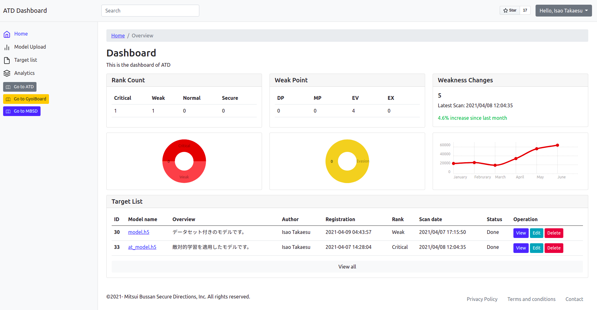

# GyoiBoard
Web interface for ATD.

  

|Note|
|:---|
|The current GyoiBoard is an alpha version. It does not implement authentication or other security features, so please be sure to use it in your local environment.|

## Installation
You have to clone ATD's repository.  
In addition, you need to install **redis** and **celery** beforehand.  

1. git clone GyoiBoard's repository.  
```
root@kali:~# git clone https://github.com/gyoisamurai/GyoiBoard
```

2. Get python3-pip.  
```
root@kali:~# apt-get update
root@kali:~# apt-get install python3-pip
```

3. Install required python packages for ATD.  
```
root@kali:~# cd GyoiBoard
root@kali:~/GyoiBoard# pip3 install -r requirements.txt
```

4. Edit `settings.py`.   
```
root@kali:~/GyoiBoard# vim ./gyoiboard/settings.py
# ATD_DIR = '/home/itakaesu/PycharmProjects/Adversarial-Threat-Detector/'
ATD_DIR = '(Your ATD's path.)'
```

## Launch
1. Launch Redis server.
```
user@kali:~/GyoiBoard# redis-server
```

2. Launch Celery.
```
user@kali:~/GyoiBoard# celery -A gyoiboard worker -l info
```

3. Launch GyoiBoard.
```
user@kali:~/GyoiBoard# python3 manage.py runserver
```

4. Access to the GyoiBoard.
```
user@kali:~/GyoiBoard# firefox http://127.0.0.1:8000/
```

## Licence
[MIT License](https://github.com/gyoisamurai/Adversarial-Threat-Detector/blob/main/LICENSE)

## Contact us
* Email  
[gyoiler3@gmail.com](mailto:gyoiler3@gmail.com)  
